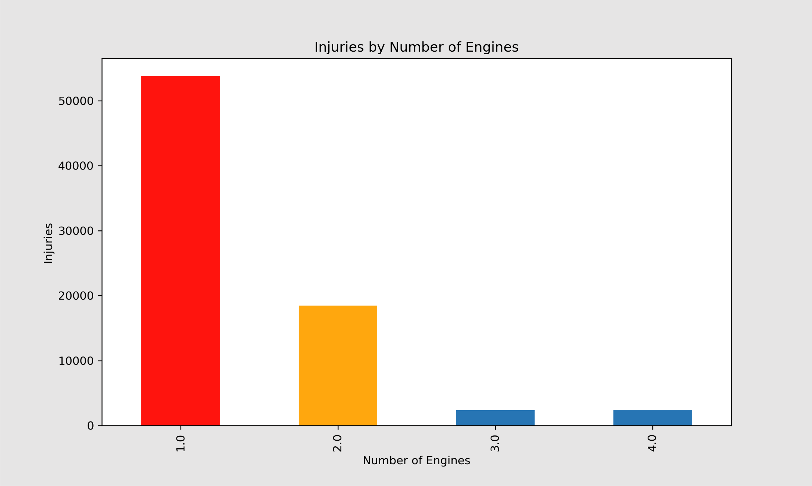
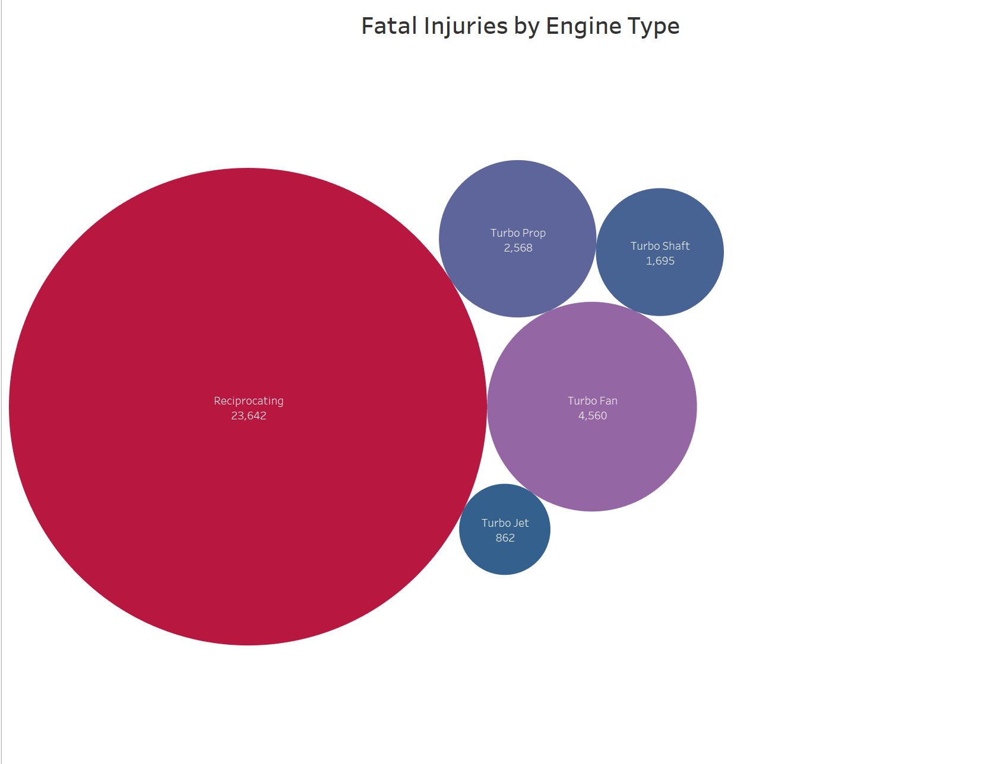
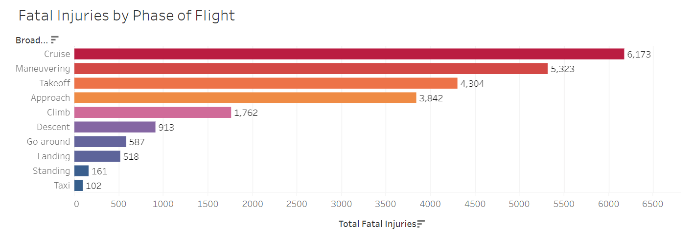
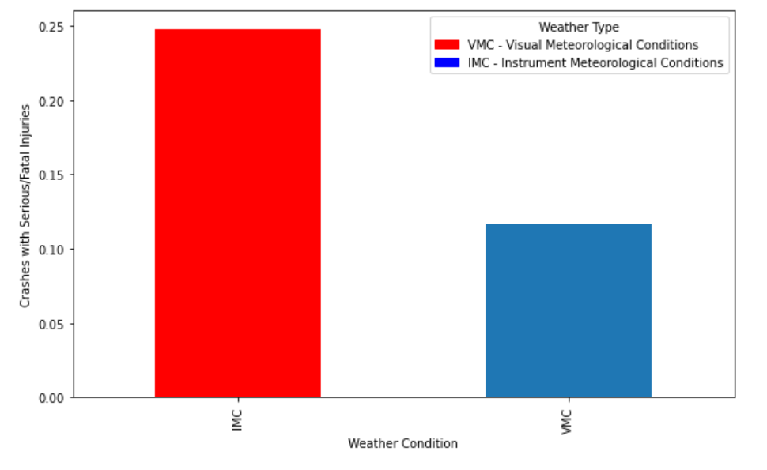

# Phase 1 Project - Risk Analysis for Plane Fleet
## Overview
This repository houses a detailed analysis of civil aviation accidents in the United States, covering incidents from 1962 to 2023. The analysis is aimed at aiding aviation directors and decision-makers in evaluating the safety records of different aircraft, focusing particularly on engine configurations, phases of flight, and weather conditions affecting flight safety.

## Business Understanding
The primary audience for this project is the director of the aviation department, who is tasked with deciding on aircraft purchases that maximize safety and efficiency. Key questions addressed include:

- What number of engines provide the safest operational outcomes?
- Which engine type is the preferable for consideration in the new fleet?
- During which phases of flight do most accidents occur, and how severe are they?
- How do different weather conditions affect flight safety?
- Data Understanding and Analysis

### Source of Data: 
The analysis utilizes data from the "Aviation Accident Database & Synopses, up to 2023," available through [Kaggle](https://www.kaggle.com/datasets/khsamaha/aviation-accident-database-synopses), which includes comprehensive information on aviation accidents provided by the National Transportation Safety Board.

### Description of Data: 
The dataset contains variables such as date of event, number of engines, weather conditions, phase of flight, and various outcomes related to results of accidents. Standard statistical measurements were used such as the mean, percents, etc. In order to draw conclusions comparisions were plotted in bar, line, and bubble charts using fatal/serious injuries and different variables. Missing data was ignored depending on size of missing data if it was statistically small enough.

### Visualizations:
Interactive Tableau Dashboard
https://public.tableau.com/app/profile/jared.lilly/viz/Phase-1-Project/AirplaneSafetyAnalysis?publish=yes

Injuries by Number of Engines: Bar charts showing injury outcomes relative to the number of engines on board demonstrate that aircraft with three or more engines tend to have lower rates of fatal injuries.

Engine Type: Bubble graph comparing by size the fatal injuries incurred by accidents organized by engine type. 

Fatal Injuries by Broad Phase of Flight: Line charts displaying the distribution of fatal injuries across different flight phases highlight increased risks during Maneuvering, Takeoff, and Cruise phases.

Impact of Weather Conditions on Flight Safety: Bar charts comparing injury ratios under Visual Meteorological Conditions (VMC) and Instrument Meteorological Conditions (IMC) illustrate that flights in IMC conditions experience a higher frequency of severe injuries.

# Conclusion
## Key Insights for Aircraft Acquisition:

 * Engine Configuration: Multiple-engine configurations, especially those with three or more engines, are associated with enhanced safety and reduced fatality rates. It is advisable to prioritize aircraft with such configurations for new acquisitions.
 * Engine Type: The most dangerous engine type is reciprocating engines. There are more fatalities in crashes with reciprocating engine than **ALL** other engine tupes combined. 
 * Phase of Flight Risks: Increased fatal injuries during Maneuvering, Takeoff, and Cruise suggest the need for robust training programs focusing on these specific phases. Purchasing aircraft known for better performance and stability during these critical phases can also mitigate risks.
 * Weather Condition Considerations: The higher risk associated with IMC conditions underscores the importance of selecting aircraft equipped with advanced navigation and weather instrumentation, which are crucial for enhancing safety in adverse weather conditions.

## Recommendations for Future Purchases:

Given the analysis, investing in aircraft with multiple engines, avoiding planes with reciprocating engines, and advanced safety procedures suitable for all weather conditions is recommended. Continuous training and adherence to updated safety protocols will further ensure the safety and efficiency of operations.

## Outline of Repository
- Checkpoints
- Images
    - fatalities_overtime.png
    - injuries_by_engine_type.png
    - number_of_engines.png
    - phase_of_flight.png
    - phase_of_flight_by_engine_number.png
    - weather_condition.png
- Data
    - archive.zip
    - USState_Codes.csv
    - AviationData.csv
- .gitignore
-README.md\
-dsc-phase-1-project.ipynb\
-Non-Technical Presentation\

## Non-technical presentation 

## Link to Personal Data Blog
https://datasciencedigested.blogspot.com/2024/05/data-analysis-or-intuition.html

